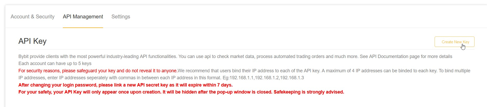
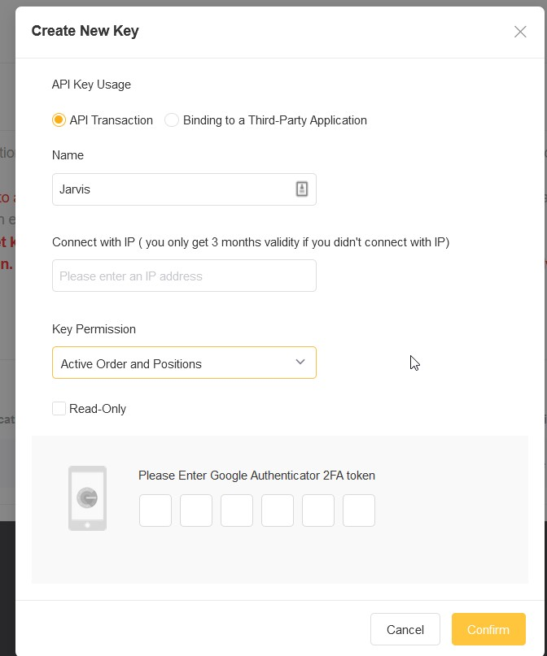

# Bybit

## Bybit: Creating API Keys and connecting to Jarvis

1. Log in to your account at [Bybit](https://www.bybit.com)

2. Follow the link to your Account API Management Page [Bybit API Management](https://www.bybit.com/app/user/api-management)

3. Click CREATE NEW KEY img

4. Select API Transaction, put in a name (e.g. QQL), leave the "Connect with IP" field black. Select "Active Order and Positions" in the Key Permissions dropbox, enter your 2FA key and confirm.

5. Copy the generated first APIPrivate Key img

6. Paste into Step 7 of the Jarvis Typeform https://jarvis-labs.typeform.com/to/cgLRrcEG img

7. Copy the generated Private Key: img

8. Paste into Step 8 of the Jarvis Typeform https://jarvis-labs.typeform.com/to/cgLRrcEG img

9. Enter None into Step 9 of the Jarvis Typeform and proceed to complete the final (self-explanatory) steps of the Jarvis Typeform. img

10. Click Understood on the window with the 2 API Keys and create a reminder on your calendar for the date of expiration (3months from date of creation) of your API Key, so that you can create a new one a few days prior to the expiration. img

11. You are all Set and Ready to make Profits with Us!

